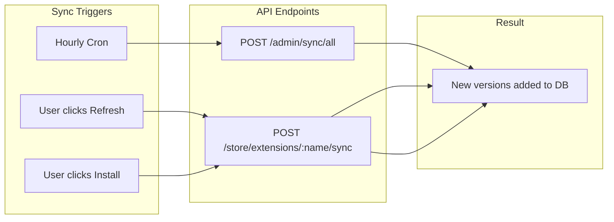
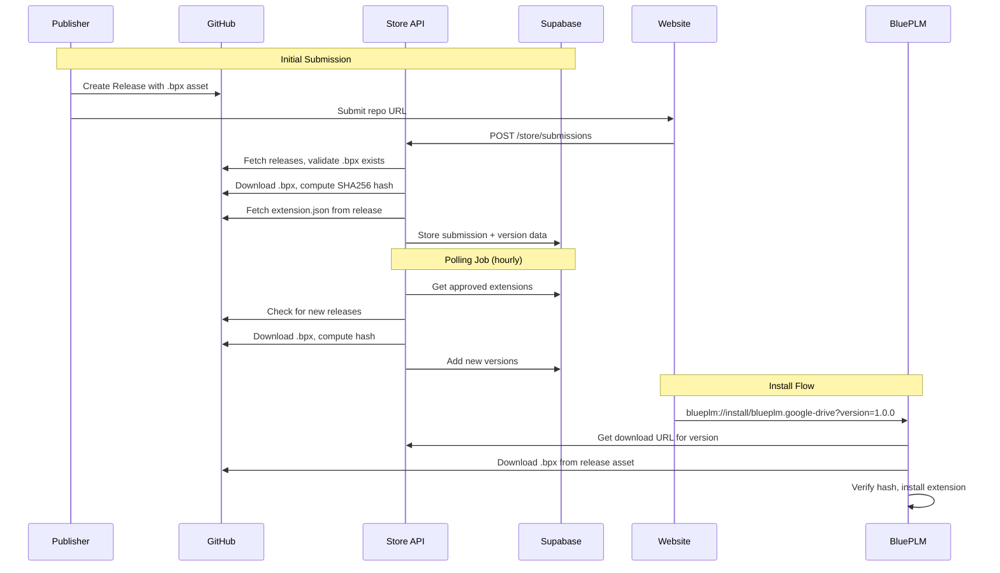
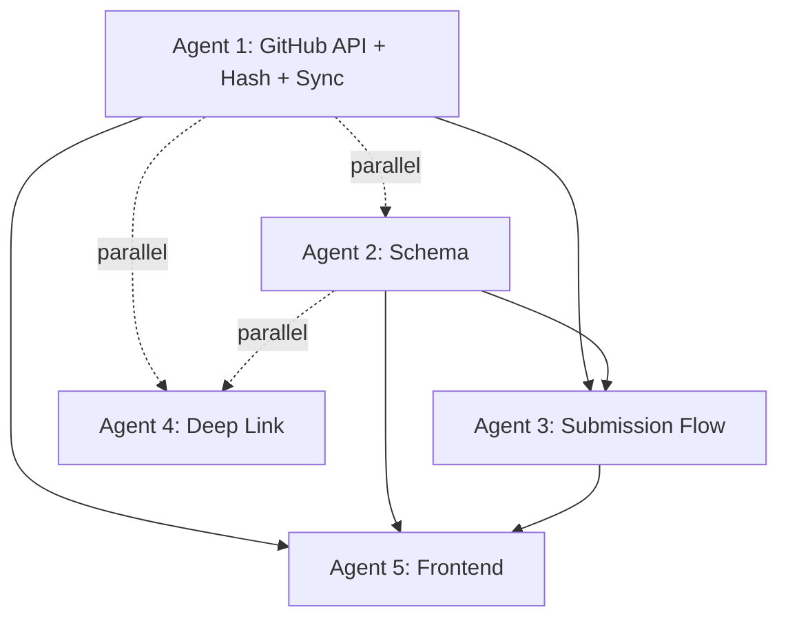

# Extension Store - GitHub Releases Integration (Revised)

## Objective

Build a robust extension distribution system where:

1. Publishers create GitHub Releases with `.bpx` files as release assets
2. Extension metadata is fetched from `extension.json` in each release
3. Polling job periodically checks for new releases (simpler than webhooks for MVP)
4. Deep link protocol enables one-click install from the website

## Key Design Decisions

| Decision | Choice | Rationale |

|----------|--------|-----------|

| Hash computation | Server downloads .bpx, computes SHA256 | Most secure, ensures integrity |

| Private repos | Public only for MVP | Avoids OAuth complexity |

| Version sync | Polling + manual refresh + auto-refresh on install | Multiple triggers ensure freshness |

| Version source of truth | `extension.json` version field | Tag is informational only |

| Deep link ID | Extension `name` field (e.g., "blueplm.google-drive") | More readable than UUID |

## Version Sync Strategy

Three triggers keep extensions up-to-date:

1. **Background polling (hourly)** - Cron job syncs all extensions periodically
2. **Manual refresh button** - User clicks "Check for updates" on extension detail page
3. **Auto-refresh on install** - Always fetches latest releases before installing



## Architecture



## Agent Overview

| Agent | Responsibility | Owns | Dependencies |

|-------|---------------|------|--------------|

| Agent 1 | GitHub API service (releases, assets, hash) | `api/src/utils/github.ts`, `api/src/routes/sync.ts` | None |

| Agent 2 | Database schema for releases and sync tracking | `supabase-store/schema.sql` | None |

| Agent 3 | Submission flow with release validation | `api/src/routes/submissions.ts` | Agent 1, 2 |

| Agent 4 | Deep link protocol in Electron | `bluePLM/electron/handlers/deepLink.ts` | None |

| Agent 5 | Frontend version selector and display | `blueplm-site/src/` | Agent 2, 3 |

---

## Agent 1: GitHub Releases API Service

### Prompt

> Create a GitHub API service for fetching releases, downloading assets, and computing hashes with enterprise-level code quality.

>

> **Scope:**

> - Create `api/src/utils/github.ts` with functions for GitHub API interactions

> - Create `api/src/routes/sync.ts` for manual sync endpoint (polling job triggers this)

> - Download .bpx files and compute SHA256 hashes server-side

>

> **CRITICAL: Rate Limiting**

> - GitHub's unauthenticated API limit is 60 requests/hour

> - With `GITHUB_API_TOKEN`, limit is 5,000 requests/hour

> - MUST use token for production reliability

> - Implement exponential backoff for rate limit responses (HTTP 403 with `X-RateLimit-Remaining: 0`)

>

> **Implementation Details:**

>

> **GitHub Utilities (`api/src/utils/github.ts`):**

> ```typescript

> // Parse GitHub repo URL to owner/repo

> parseGitHubUrl(url: string): { owner: string; repo: string } | null

>

> // Fetch all releases for a repo (uses GITHUB_API_TOKEN if available)

> fetchReleases(owner: string, repo: string): Promise<GitHubRelease[]>

>

> // Fetch extension.json from a specific release tag

> fetchExtensionManifest(owner: string, repo: string, tag: string): Promise<ExtensionManifest>

>

> // Find .bpx asset in release assets

> findBpxAsset(release: GitHubRelease): GitHubAsset | null

>

> // Download .bpx file and compute SHA256 hash

> downloadAndHashBpx(downloadUrl: string): Promise<{ hash: string; size: number }>

>

> // Validate extension manifest has required fields

> validateManifest(manifest: unknown): { valid: boolean; errors: string[] }

> ```

>

> **Sync Endpoints (`api/src/routes/sync.ts`):**

>

> **1. Admin bulk sync (for cron job):**

> - `POST /admin/sync/all` - Admin-only, syncs ALL approved extensions

> - Called by Cloudflare Cron Trigger hourly

> - For each approved extension: fetch releases, find new ones, download .bpx, compute hash, add versions

>

> **2. Public single-extension sync (for manual refresh and install):**

> - `POST /store/extensions/:name/sync` - Public, rate-limited (10/min per IP)

> - Syncs a single extension by name (e.g., "blueplm.google-drive")

> - Returns: `{ updated: boolean, latestVersion: string, newVersions: string[] }`

> - Called by: "Check for updates" button, Install flow (before downloading)

>

> **GitHub Release Structure:**

> ```typescript

> interface GitHubRelease {

>   tag_name: string       // e.g., "v1.0.0"

>   name: string           // Release title

>   body: string           // Release notes (changelog) - SANITIZE for XSS!

>   prerelease: boolean

>   published_at: string

>   assets: GitHubAsset[]

> }

>

> interface GitHubAsset {

>   name: string               // e.g., "extension.bpx"

>   browser_download_url: string

>   size: number

> }

>

> interface ExtensionManifest {

>   id: string             // e.g., "blueplm.google-drive" - USED IN DEEP LINKS

>   name: string           // Display name, e.g., "Google Drive Integration"

>   version: string        // SOURCE OF TRUTH for version (not tag)

>   description: string

>   icon?: string          // Relative path in repo

>   categories?: string[]

>   license?: string

> }

> ```

>

> **IMPORTANT: Version Source of Truth**

> - The `version` field in `extension.json` is authoritative

> - The Git tag is informational only

> - If tag (e.g., "v2.0.0") doesn't match manifest version (e.g., "1.0.0"), log a warning but use manifest version

>

> **Changelog Sanitization:**

> - GitHub release `body` can contain arbitrary Markdown/HTML

> - Sanitize for XSS before storing (use DOMPurify or similar)

> - Store sanitized version in database

>

> **Boundaries:**

> - OWNS: `api/src/utils/github.ts`, `api/src/routes/sync.ts`

> - READS: `api/src/types.ts`

> - Do NOT modify: submission routes, database schema

>

> **Environment Variables Needed:**

> - `GITHUB_API_TOKEN` - Personal Access Token for 5,000 req/hour (REQUIRED for production)

>

> **Quality Requirements:**

> - Exponential backoff for rate limit responses

> - Proper error handling for network failures

> - TypeScript types for all GitHub responses

> - Timeout handling for large .bpx downloads (max 50MB, 30s timeout)

>

> **Deliverables:**

> - `api/src/utils/github.ts` with release fetching and hash utilities

> - `api/src/routes/sync.ts` with sync endpoint

> - Types in `api/src/types.ts`

> - Report in `blueplm-site/AGENT1_GITHUB_REPORT.md`

### Tasks

- [ ] Create GitHub URL parser with validation
- [ ] Implement releases fetching via GitHub API with auth token
- [ ] Implement extension.json fetching from release tags
- [ ] Implement .bpx asset detection in releases
- [ ] Implement .bpx download and SHA256 hash computation
- [ ] Implement exponential backoff for rate limiting
- [ ] Implement manifest validation
- [ ] Implement changelog sanitization (XSS prevention)
- [ ] Create admin bulk sync endpoint (`POST /admin/sync/all`)
- [ ] Create public single-extension sync endpoint (`POST /store/extensions/:name/sync`)
- [ ] Add rate limiting to public sync endpoint (10/min per IP)
- [ ] Add types to api/src/types.ts
- [ ] Mount routes in api/src/routes/index.ts

---

## Agent 2: Database Schema Updates

### Prompt

> Update the database schema to support GitHub releases and sync tracking with enterprise-level code quality.

>

> **Scope:**

> - Add columns to `extension_submissions` for fetched release data

> - Ensure `extension_versions` table properly stores release info with hash

> - Add table for tracking sync job state

> - Update `approve_submission` to create initial version with all data

> - Bump schema version to 3

>

> **Schema Changes:**

>

> ```sql

> -- Add to extension_submissions:

> ALTER TABLE extension_submissions ADD COLUMN IF NOT EXISTS

>   github_owner TEXT,

>   github_repo TEXT,

>   latest_release_tag TEXT,

>   fetched_manifest JSONB,         -- Full extension.json

>   fetched_version TEXT,           -- From manifest (SOURCE OF TRUTH)

>   fetched_display_name TEXT,      -- From manifest "name"

>   fetched_description TEXT,       -- From manifest "description"

>   fetched_icon_url TEXT,          -- Icon from release or repo

>   fetched_categories TEXT[],      -- From manifest

>   fetched_license TEXT,           -- From manifest

>   bpx_download_url TEXT,          -- Release asset URL

>   bpx_hash TEXT,                  -- SHA256 hash computed server-side

>   bpx_size INTEGER,               -- Asset size in bytes

>   changelog TEXT,                 -- Sanitized release notes

>   fetch_error TEXT,               -- Error if fetch failed

>   fetched_at TIMESTAMPTZ;

>

> -- Sync job tracking (replaces webhook events)

> CREATE TABLE IF NOT EXISTS extension_sync_log (

>   id UUID PRIMARY KEY DEFAULT gen_random_uuid(),

>   extension_id UUID REFERENCES extensions(id) ON DELETE CASCADE,

>   started_at TIMESTAMPTZ DEFAULT NOW(),

>   completed_at TIMESTAMPTZ,

>   releases_checked INTEGER,

>   versions_added INTEGER,

>   status TEXT NOT NULL DEFAULT 'running',  -- running, success, error

>   error_message TEXT,

>   CONSTRAINT valid_status CHECK (status IN ('running', 'success', 'error'))

> );

>

> -- Index for finding extensions that need sync

> CREATE INDEX idx_extensions_last_synced ON extensions(last_synced_at);

> ```

>

> **CRITICAL: Update approve_submission function:**

>

> The current function creates an extension but does NOT create the initial version. Update it to:

>

> ```sql

> -- In approve_submission function, AFTER creating the extension:

>

> -- Create initial version from fetched data

> INSERT INTO extension_versions (

>   extension_id,

>   version,           -- Use fetched_version from submission

>   manifest,          -- Use fetched_manifest from submission

>   changelog,         -- Use changelog from submission (sanitized)

>   bundle_url,        -- Use bpx_download_url from submission

>   bundle_hash,       -- Use bpx_hash from submission (REQUIRED!)

>   bundle_size,       -- Use bpx_size from submission

>   published_at

> ) VALUES (

>   v_extension_id,

>   p_submission.fetched_version,

>   p_submission.fetched_manifest,

>   p_submission.changelog,

>   p_submission.bpx_download_url,

>   p_submission.bpx_hash,

>   p_submission.bpx_size,

>   NOW()

> );

> ```

>

> **Field Mappings (submission → extension):**

> - `fetched_display_name` → `extensions.display_name`

> - `fetched_description` → `extensions.description`

> - `github_owner` + `github_repo` → `extensions.repository_url`

> - `fetched_categories` → `extensions.categories`

> - `fetched_license` → `extensions.license`

> - `fetched_manifest.id` → `extensions.name` (the unique identifier used in deep links)

>

> **Schema Version Bump:**

> ```sql

> INSERT INTO schema_version (version, description)

> VALUES (3, 'GitHub Releases integration with hash verification');

> ```

>

> **Boundaries:**

> - OWNS: `supabase-store/schema.sql`

> - Do NOT modify: API code

>

> **Deliverables:**

> - Updated schema with new columns

> - Sync log tracking table

> - Updated approve_submission function with version creation

> - Function to add new versions from sync job

> - Schema version bumped to 3

> - Migration SQL for existing databases

> - Report in `blueplm-site/AGENT2_SCHEMA_REPORT.md`

### Tasks

- [ ] Add fetched_* columns to extension_submissions
- [ ] Add github_owner, github_repo columns
- [ ] Add bpx_download_url, bpx_hash, bpx_size columns
- [ ] Add changelog column for sanitized release notes
- [ ] Create extension_sync_log table
- [ ] Add last_synced_at column and index to extensions
- [ ] Update approve_submission to create initial version with hash
- [ ] Create function to add version from sync job
- [ ] Bump schema version to 3
- [ ] Create migration SQL for existing data

---

## Agent 3: Submission Flow with Release Validation

### Prompt

> Update the submission flow to validate GitHub releases, fetch metadata, and compute hashes with enterprise-level code quality.

>

> **Scope:**

> - Update `api/src/routes/submissions.ts` to validate and fetch release data

> - Require at least one release with .bpx asset

> - Download .bpx and compute SHA256 hash

> - Store all fetched metadata in submission record

>

> **IMPORTANT: Public Repos Only**

> - For MVP, only support public GitHub repositories

> - If GitHub API returns 404, the repo is either private or doesn't exist

> - Error message: "Repository not found. Note: Private repositories are not supported yet."

>

> **Validation Flow:**

> 1. Parse GitHub URL to get owner/repo

> 2. Fetch releases from GitHub API

> 3. Validate at least one release exists

> 4. Find latest non-prerelease with .bpx asset

> 5. Download .bpx and compute SHA256 hash

> 6. Fetch extension.json from that release tag

> 7. Validate manifest has required fields

> 8. If manifest version differs from tag, log warning but use manifest version

> 9. Sanitize changelog (release body) for XSS

> 10. Store all data in submission record

>

> **Error Messages (user-friendly):**

> - "Invalid GitHub URL format. Expected: https://github.com/owner/repo"

> - "Repository not found. Note: Private repositories are not supported yet."

> - "No releases found. Please create a GitHub Release with a .bpx file attached."

> - "No .bpx file found in any release. Attach your extension package (.bpx) to a GitHub Release."

> - "extension.json not found in release. Make sure your repository root contains an extension.json file."

> - "extension.json missing required field: {field}"

> - "Failed to download .bpx file. Please try again later."

>

> **Required manifest fields:**

> - `id` - Extension identifier (e.g., "blueplm.google-drive") - USED IN DEEP LINKS

> - `name` - Display name (e.g., "Google Drive Integration")

> - `version` - Semver version (SOURCE OF TRUTH)

> - `description` - Short description

>

> **Boundaries:**

> - OWNS: `api/src/routes/submissions.ts`, `api/src/schemas/submissions.ts`

> - USES: `api/src/utils/github.ts` (from Agent 1)

> - READS: Database schema (from Agent 2)

>

> **Deliverables:**

> - Updated submission endpoint with release validation

> - Hash computation during submission

> - Clear, helpful error messages

> - Report in `blueplm-site/AGENT3_SUBMISSION_REPORT.md`

### Tasks

- [ ] Import GitHub utilities from Agent 1
- [ ] Parse and validate GitHub URL
- [ ] Fetch releases and validate at least one exists
- [ ] Find latest non-prerelease with .bpx asset
- [ ] Download .bpx and compute SHA256 hash
- [ ] Fetch and validate extension.json from release
- [ ] Handle version mismatch between tag and manifest
- [ ] Sanitize changelog for XSS
- [ ] Store all fetched data in submission record
- [ ] Provide helpful, specific error messages
- [ ] Test with real repo (blueplm-ext-google-drive)

---

## Agent 4: Deep Link Protocol (Electron)

### Prompt

> Implement the `blueplm://` deep link protocol in the Electron app with enterprise-level code quality.

>

> **Scope:**

> - Register `blueplm://` protocol handler

> - Handle install action with optional version

> - Cross-platform support (Windows, macOS, Linux)

> - Trigger the existing IPC install flow

>

> **URL Format:**

> - `blueplm://install/{extension-name}` - Install latest version

> - `blueplm://install/{extension-name}?version=1.0.0` - Install specific version

>

> **IMPORTANT: Extension Name vs UUID**

> - Deep links use the extension `name` field (e.g., "blueplm.google-drive"), NOT the UUID

> - This matches the `id` field in extension.json

> - More readable and stable than UUIDs

>

> **Implementation:**

>

> **1. Protocol Registration (`electron/main.ts`):**

> ```typescript

> // Register protocol - call BEFORE app.whenReady()

> if (process.defaultApp) {

>   if (process.argv.length >= 2) {

>     app.setAsDefaultProtocolClient('blueplm', process.execPath, [path.resolve(process.argv[1])])

>   }

> } else {

>   app.setAsDefaultProtocolClient('blueplm')

> }

> ```

>

> **2. Deep Link Handler (`electron/handlers/deepLink.ts`):**

> ```typescript

> interface DeepLinkAction {

>   action: 'install' | 'open'

>   extensionName?: string   // NOT extensionId - using name field

>   version?: string

> }

>

> function parseDeepLink(url: string): DeepLinkAction | null

> function handleDeepLink(url: string, mainWindow: BrowserWindow): void

> ```

>

> **3. Platform-specific URL handling:**

> - macOS: `app.on('open-url', (event, url) => handleDeepLink(url, mainWindow))`

> - Windows/Linux: Check `process.argv` on startup AND `app.on('second-instance', (event, argv) => { /* find URL in argv */ })`

>

> **4. Trigger install flow:**

> - Parse URL to get extension name and version

> - Send IPC to renderer: `mainWindow.webContents.send('deep-link:install', { extensionName, version })`

> - Renderer should show install confirmation dialog

>

> **NOTE: Existing Placeholder**

> The `extensions:install` handler in `electron/handlers/extensionHost.ts` currently returns:

> ```typescript

> return { success: false, error: 'Store installation not yet implemented' }

> ```

> Agent 4 should trigger this existing flow - actually implementing the download/install is a separate task.

>

> **Boundaries:**

> - OWNS: `electron/handlers/deepLink.ts`, protocol registration in `electron/main.ts`

> - READS: existing IPC patterns in `electron/handlers/`

> - Do NOT modify: extension install logic, renderer code (except to add IPC listener)

>

> **Testing on Windows:**

> - After installing, test: `start blueplm://install/blueplm.google-drive?version=1.0.0`

> - App should open and show install dialog

>

> **Deliverables:**

> - `electron/handlers/deepLink.ts` with URL parser and handler

> - Protocol registration in `electron/main.ts`

> - Cross-platform URL handling

> - Report in `bluePLM/AGENT4_DEEPLINK_REPORT.md`

### Tasks

- [ ] Create electron/handlers/deepLink.ts
- [ ] Implement parseDeepLink function
- [ ] Implement handleDeepLink function
- [ ] Add protocol registration to main.ts (before app.ready)
- [ ] Handle open-url event for macOS
- [ ] Handle second-instance event for Windows/Linux
- [ ] Check process.argv on startup for Windows
- [ ] Send IPC to renderer with install request
- [ ] Test on Windows with `start blueplm://install/...`

---

## Agent 5: Frontend Updates

### Prompt

> Update the extension store frontend to display version history, proper metadata, and support version selection with enterprise-level code quality.

>

> **Scope:**

> - Show version selector on extension detail page

> - Display changelog from GitHub release notes

> - Fix existing InstallButton to include version in deep link

> - Show proper metadata (display name, description) from fetched data

>

> **CRITICAL BUG TO FIX FIRST:**

> The existing `InstallButton.tsx` accepts a `version` prop but IGNORES it:

> ```typescript

> // Current (broken):

> const deepLink = `blueplm://install/${extensionId}`

>

> // Should be:

> const deepLink = version

>   ? `blueplm://install/${extensionName}?version=${version}`

>   : `blueplm://install/${extensionName}`

> ```

> Also note: use extension `name` field (e.g., "blueplm.google-drive"), not UUID.

>

> **Changes:**

>

> **1. Extension Detail Page (`src/pages/marketplace/Extension.tsx`):**

> - Add version dropdown in install section

> - Show changelog/release notes for selected version

> - Display display_name (human-readable) prominently

> - Show description from fetched data

> - Add "Check for updates" refresh button (see #5)

>

> **2. Install Button (`src/components/marketplace/InstallButton.tsx`):**

> - FIX: Include version in deep link URL

> - Use extension name (e.g., "blueplm.google-drive") not UUID

> - BEFORE opening deep link, call sync API to ensure latest versions (see #6)

>

> **3. Version Selector UI Requirements:**

> - Dropdown showing all available versions

> - Format: "v1.2.0 (Dec 15, 2025)" with relative date

> - Latest version selected by default

> - Pre-release versions marked with badge

> - Show changelog for selected version below dropdown

>

> **4. Version History Section:**

> - List all versions with release dates

> - Show download count per version (if available)

> - Collapsible changelog for each version

>

> **5. Manual Refresh Button:**

> - Add "↻ Check for updates" button near version selector

> - Calls `POST /store/extensions/:name/sync`

> - Shows loading spinner while syncing

> - On success: refresh version list, show toast if new versions found

> - On error: show error toast

>

> **6. Auto-refresh on Install:**

> - When user clicks "Install in BluePLM":

>   1. Show "Checking for updates..." state

>   2. Call `POST /store/extensions/:name/sync`

>   3. If new versions found, update version selector and ask user to confirm

>   4. Proceed with deep link to install

>

> **Note on Testing:**

> - Full end-to-end testing requires Agent 4 (deep link handler) to be completed

> - Frontend changes can be developed and visually tested independently

> - Install button will open blueplm:// URL but app won't respond until Agent 4 is done

>

> **Boundaries:**

> - OWNS: `src/pages/marketplace/Extension.tsx`, `src/components/marketplace/InstallButton.tsx`

> - MAY CREATE: `src/components/marketplace/VersionSelector.tsx`

> - READS: `src/lib/api.ts`

>

> **Deliverables:**

> - Fixed InstallButton with version parameter and auto-refresh

> - Version selector dropdown component

> - "Check for updates" refresh button

> - Changelog display

> - Updated extension detail page

> - API function for sync endpoint

> - Report in `blueplm-site/AGENT5_FRONTEND_REPORT.md`

### Tasks

- [ ] FIX: InstallButton to include version in deep link
- [ ] FIX: Use extension name instead of UUID in deep link
- [ ] Create VersionSelector component
- [ ] Add version dropdown to extension detail page
- [ ] Display changelog for selected version
- [ ] Show display_name prominently
- [ ] Show description from fetched data
- [ ] Mark pre-release versions with badge
- [ ] Add "Check for updates" refresh button
- [ ] Call sync API on refresh, show loading/success/error states
- [ ] Add auto-refresh before install (call sync API, confirm if new versions)
- [ ] Add API function in src/lib/api.ts for sync endpoint
- [ ] Style version history section
- [ ] Test version selection UI
- [ ] Test refresh and auto-refresh flows

---

## Execution Order



**Execution order:**

1. **Parallel**: Agent 1 (GitHub API), Agent 2 (Schema), Agent 4 (Deep Link)
2. **After 1 and 2**: Agent 3 (Submission Flow)
3. **After 1, 2, and 3**: Agent 5 (Frontend) - needs sync API from Agent 1

**Note**: Agent 5 can develop independently but full testing requires Agent 1 (sync API) and Agent 4 (deep links).

---

## Environment Setup

Add these to Cloudflare Worker secrets:

- `GITHUB_API_TOKEN` - Personal Access Token (Classic) with `public_repo` scope for 5,000 req/hour

**Creating the GitHub PAT:**

1. Go to GitHub Settings > Developer settings > Personal access tokens > Tokens (classic)
2. Generate new token (classic)
3. Name: "BluePLM Store API"
4. Expiration: 90 days (set reminder to rotate)
5. Scopes: `public_repo` only
6. Add to Cloudflare Worker: `wrangler secret put GITHUB_API_TOKEN`

**Setting up polling (Cloudflare Cron Trigger):**

```toml
# In wrangler.toml
[triggers]
crons = ["0 * * * *"]  # Every hour
```

---

## Future Enhancements (Out of Scope for MVP)

1. **GitHub Webhooks** - Replace polling with real-time updates
2. **GitHub App** - Better than PAT for rate limits and security
3. **Private repo support** - OAuth flow for publishers
4. **Error recovery** - Retry failed sync operations
5. **Version yanking** - Allow publishers to mark versions as unsafe

---

## Testing Checklist

- [ ] Submit extension with valid GitHub releases
- [ ] Verify .bpx hash is computed correctly
- [ ] Verify metadata fetched correctly (display name, description, version)
- [ ] Approve submission, verify version created with hash
- [ ] Verify display_name shows on extension card
- [ ] Create new release on GitHub
- [ ] Click "Check for updates" button, verify new version appears
- [ ] Verify auto-refresh on install shows new version if available
- [ ] Trigger sync job manually
- [ ] Verify new version appears in store
- [ ] Click "Install in BluePLM" on website
- [ ] Verify deep link includes version parameter
- [ ] Verify app opens (requires Agent 4)
- [ ] Test installing specific older version